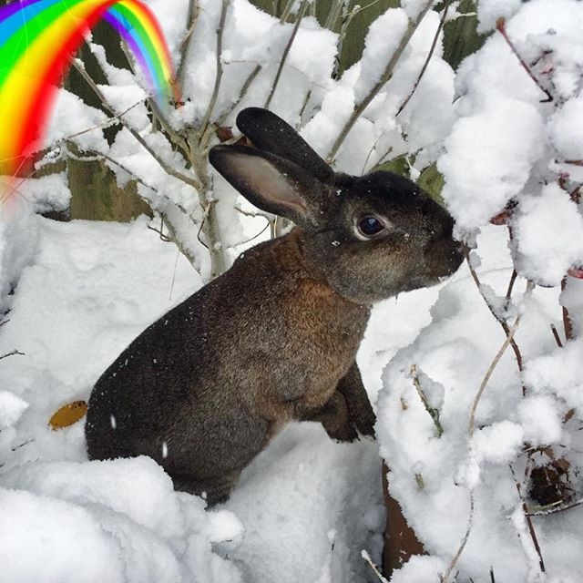

*Posted to [Instagram](https://www.instagram.com/p/BhukmXGAT8G/), April 18th 2018*

We are heartbroken to have to say that we've lost our sweet girl, Joy. She was put to sleep at the vets yesterday after fighting the snuffles for a fortnight wore her down. She'd developed an abscess in her nasal passage and was using all her energy to breathe. It was a tough decision to make but we couldn't put her through surgery. 

Joy had a 'Watership Down' adventure of a life. We've no idea where she started out. She was found dumped in the local nature reserve in March 2016. A posse of concerned bunny lovers caught her and Fiona brought her home as all the rescue centres were full. Of course, once she was through the door there was no way she was leaving us. Suffering bite wounds and infested with fleas it took her a couple of weeks to recover and then we discovered what an amazing rabbit we had. 
She loved living with her husbun Bunminster and bun-sister Clem, and us as her human servants. Although she was the boss, she had such a sweet nature and was friendlier than most rabbits, licking her loved ones vigorously. Rabbits don’t make noise usually but she used to honk with happiness whenever she got her breakfast. She was the ultimate snugglebunny, loving her headrubs and making sure her pack was well groomed. It's safe to say she was also a rabbit that made us realise how much closer you can get to this complicated species.

Every moment since her rescue has been a gift so while we're heartbroken and wish we could have done more, we also know we gave her those two years in the company of Bunminster and Clem, who she leaves behind. They seem subdued but at least they have each other. Binky-free over the Rainbow Bridge, sweet girl. We miss you, Joy Joy. xxxxx

***

## The Story of Joy

*The following was written by Fiona and posted to Instagram in 10 installments.* 

Here she is in our garden, petrified and looking for a way out. This was the first photo we ever took of her after she was dumped in local woodland. We helped catch her in Joy’s Wood hence the name. Oh Happy Day was playing on the radio as we took her to the vets for a checkover. When she came home with us, she didn’t know if we were good or bad hoomins but thankfully she was the loveliest bun and we’re so glad we had her for the two years we did.

***

The story of Joy continues as she makes headlines about buns being abandoned at Easter... but is then scooped by Bunminster playing football!

Never seen so many ear positions on a rabbit. Joy was a Rex cross so they were usually up but also forward (alert) and flat (chilling) and all variations in between, like finely tuned antennae. She was always the first to hear the treat box being picked up, before we even got to shake it. Joy also liked an ear rub, although cheeks were her utmost top favourite.

***

Here we are helping our little rescue bun to get to know us through the cunning use of an apple. Joy was very quick to learn and very sharp in her senses - she was the hare, Bunminster and Clem were tortoises in comparison. Although she grew to love and trust us, her first love was always food. 🍏 🍎 🍌

***

It was hate at first sight when these two met. Bunminster felt his territory was threatened; Joy had come from who knows where and had been abandoned in some woodland. We had to keep them separate until she was neutered. Then we tried to bond them and there was a nasty fight. So we took them to @fat_fluffs to bond with other rabbits in a group - and, oh the irony, these two fell head over heels for each other. It was the last thing we expected but the snuggles wouldn’t end - Bunminster needed endless under-chin attention and Joy was a licking addict. It was a match made in bunny heaven.

***

This is the bonded floofle going off to the vets for their vaccinations. They all love the vet soooo much! Can you tell? Joy got particularly scared of going because she had to have a lot more treatments. She’s had stitches from various fights, a neutering operation, then there was GI stasis and the recent chronic snuffles and abscess. And of course three lots of vaccinations each year. To keep the buns calm as possible they normally make the vet trip as a group so they can protect and comfort each other. It also usually involves someone sitting on someone’s head or lying across them. Here they are in a triangle tangle.

***

Here’s our girl looking like a character from Beatrix Potter. It looks like a little red waistcoat but really it’s part of a lead so you can take your bunnies for a walkabout. (We tried it with all our buns and none of them tolerated it.) Seeing Joy like this makes me want to write a little story about her. I think she’d be a bossy little madam bun, maybe a suffragette bunny out getting votes for rabbits to have better and cage-free living accommodations, and campaigning for more bananas and apple treats, and enough space to binky around at high speed. Or maybe a rabbit librarian cataloguing all the baby bunny names in the world. What do you think?

***

The story of Joy is as much about the effect she had on those around her as about her. She actively changed the way we, her hoomin family, were with rabbits because she was the first of our buns to actively seek our attention. She could also be picked up (until Joy, Fiona was unable to handle rabbits because of their speed and jumpiness). She gave us confidence to be better rabbit wranglers and this led to volunteering at @fat_fluffs. Even better, Bunminster found his true love in his second bunwife. Bunzilla was his first love but she wasn’t very loving. Joy gave him the endless attention and snuggles he craved. They became a truly bonded pair whose default was to sit side by side, head to toe, or as here on top of each other. I’m sure he really misses her but at least he has Clem for company. We all miss her greatly. These little buns take a piece of your heart, they really do.

***

this is the day she became a snow queen, diving and bounding through the snow, stopping to check for hidden greens and racing the other two down the long garden. Who knows what capacity for joy rabbits have but in the two years we had Joy, she lived up to her name -there were a whole lot of high speed runs, binkies and snow jumping to go with all the licking and snuggling. She was usually first to explore and quite fearless but she also had a lot of mad moments when those crazy rabbit hormones took hold. Go JoyJoy! Binky free little one. ❤️🌈🐰

***

Coming to the end of her story is like losing her all over again. We miss Joy every day. 😢 She was a gorgeous bun with a big personality. Wish she were still here. Binky free sweet girl. ❤️❤️❤️

***